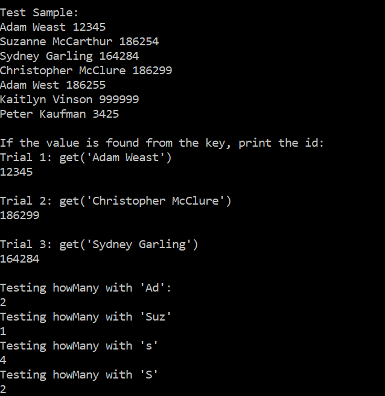
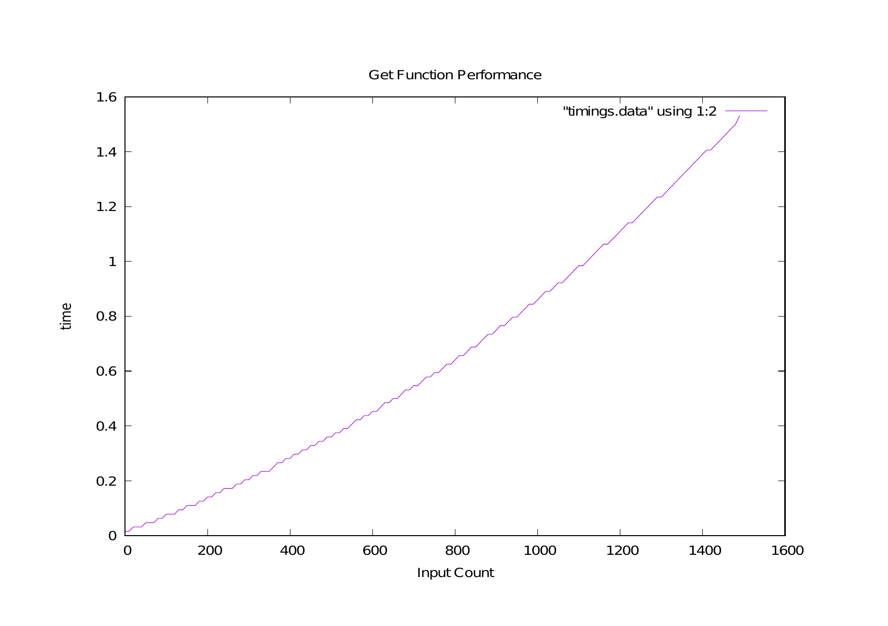

# Large_Map_Project
Large Map Project Implemented in C++ for CSCI 315: Data Structures with Dr. Paul West

Project scope involved being able to implement "Get" and "HowMany" Functions that would search a data structure effectively in order to retrieve a key through a value entry. HashTable Implementations was not possible due to the extra Functionality of the HowMany Function requirements.
Want to run it?

"make && ./map-test" in your bash command line

Functionality Tests

Performance is of O(Logn) Complexitity due to the binary search implementation combined with sorting when inserted 

Full Project Scope can be found here:

[Full Project PDF and Function Descriptions](project1-1.pdf)
